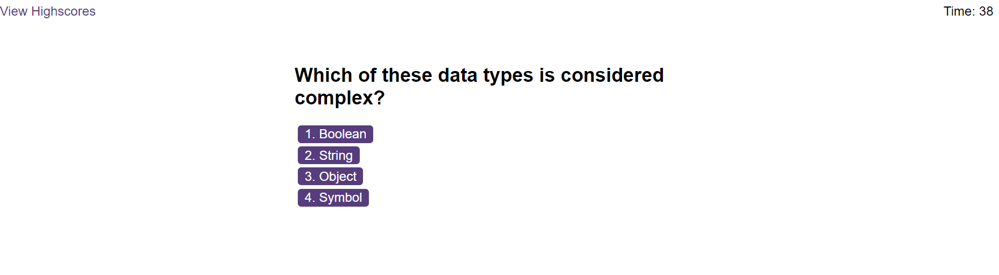
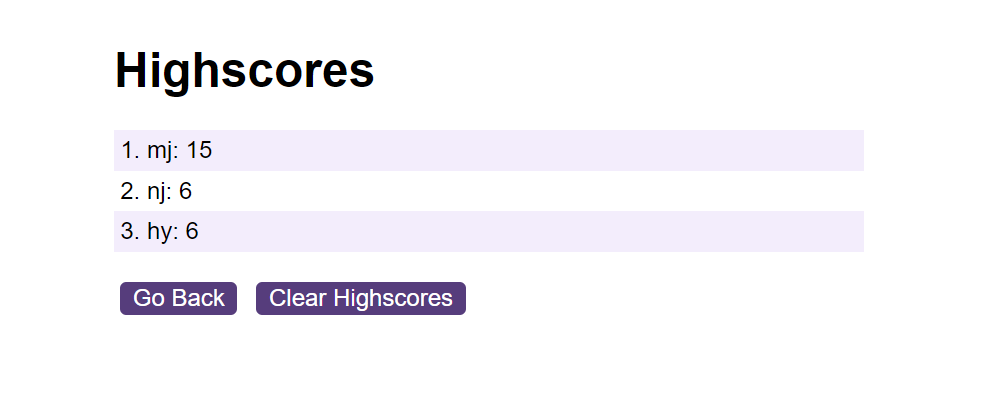

# code-quiz

## Description

This is a webpage that allows users to test their JavaScript knowledge.
[View](https://eula-snow.github.io/code-quiz/)

## Installation

N/A

## Usage

This webpage allows users to take a quiz on JavaScript. To begin, a user has to click the "Start" button. The quiz contains five questions that must be answered in 60 seconds. There is a timer in the upper right corner of the webpage that shows the time left. Below each question there are four buttons with answer options, among which only one is correct. After the user selects an answer, the next question will be displayed. Also, a message and a corresponding sound will appear, indicating whether the answer to the previou question is correct. If the answer is wrong, 10 seconds will be subtracted from the timer. When all questions are answered or when the time runs out, the user will be shown their score and prompted to enter their initials. After the user submits their initials, a scoreboard will be displayed.

## Credits

N/A

## License

Please refer to the LICENSE in the repo.
